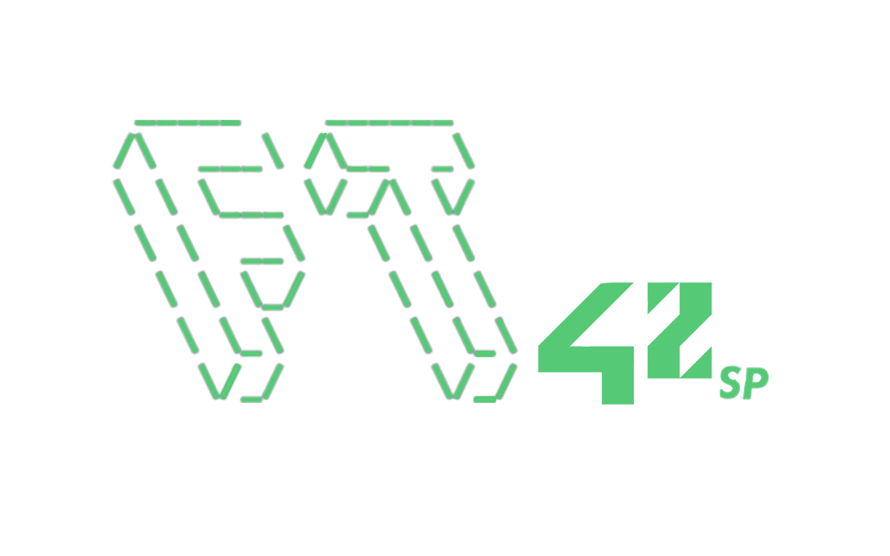

<div>
<p align="center">
   
</p>
</div>
<p align="center">
  <a aria-label="Completed" href="https://www.42sp.org.br/">
    </img>
  </a>
  <a href="https://github.com/Face-Tattoo/GNL-Benchmark/commits/master">
    
  </a>

  <a href="https://github.com/Face-Tattoo/GNL-Benchmark/stargazers">
    
  </a>
</p>

<div align="center">
  <sub>get_next_line BenchMark. Made with ❤︎!
    </a>
  </sub>
</div>


# :sparkles: What's get_next_line?

The aim of this project is to make you code a function that returns a line, read from a file descriptor.

---

# :clipboard: List of Archives
<h3 align=center>Standard</h3>
<i>In this files, you will find GNL using standard lists and recursive function that's using `strjoin` and other function from libft.</i>


<h3 align=center>Linked List</h3>
<i>In this files, you will find GNL using linked list thats is a recourse that's more efficient that the standard list from `C`, we learn about it in the bonus of the libft, and this is probably more efficient.</i>


## Functions from Standard

- [`get_next_line`](GNL/get_next_line.c)	- all non-libft functions that's necessary to run the GNL.
- [`get_next_line_utils`](GNL/get_next_line_utils.c)	- all functions from libft that's necessary to run the GNL.
- [`get_next_line header`](GNL/get_next_line.h)		- the header of the GNL.

## Functions from Linked List

- [`get_next_line`](GNLinked/get_next_line.c)	- all non-libft functions that's necessary to run the GNL.
- [`get_next_line_utils`](GNLinked/get_next_line_utils.c)	- all functions from libft that's necessary to run the GNL.
- [`get_next_line header`](GNLinked/get_next_line.h)		- the header of the GNL.

---

# :computer: Technologies

This Project was made with:

* [C](https://devdocs.io/)
* [Makefile](https://www.gnu.org/software/make/manual/make.html)
* [Shell](https://unixguide.readthedocs.io/en/latest/unixcheatsheet/)
* [gcc](https://terminaldeinformacao.com/2015/10/08/como-instalar-e-configurar-o-gcc-no-windows-mingw/)

---

# :construction_worker: How to Run
```bash
# If you want a Script for testing use this :
# https://github.com/Tripouille/gnlTester

# or use the example_main.c in the main folder and make you the test.

# Clone the Repo
$ git clone https://github.com/luizlcezario/get_next_line.git

# Enter in the Folder
$ cd get_next_line

# *************COMMANDS************ #
# what of the to GNLs you want to test entry in the folder
$ cd GNL or cd GNLinked


# for test with the example_main.c you need to copy the example_main.c
#folder the folder and than rename to main.c and run the comamand below.

# then run this command to generate the exe of
$ make all

# run the test with the main example
$ ./get_next_line

```
---

# :bug: Issues?

Please feel free **to create a new issue**. If you have already found the solution to the problem, **I would love to review your pull request**!


Give ⭐️ if you like this project!

---
```
 ____  __    ___  ____  ____  __  ____  ____  __    __
(  __)/ _\  / __)(  __)(_  _)/ _\(_  _)(_  _)/  \  /  \
 ) _)/    \( (__  ) _)   )( /    \ )(    )( (  O )(  O )
(__) \_/\_/ \___)(____) (__)\_/\_/(__)  (__) \__/  \__/
```
[FaceTatto](https://github.com/Face-Tattoo/)

